<div align="center">

<picture>
  <source media="(prefers-color-scheme: dark)" srcset="public/brand/veltron-logo-light.svg" />
  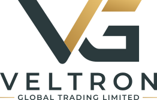
</picture>

<h3>Corporate website for VELTRON Global Trading Limited</h3>

<p>International trading of cement, clinker, gypsum, construction materials and industrial raw materials — Hong Kong.</p>

<p>
  
  
  
  
  
  
  
  
  
</p>

</div>

---

## Overview

A multilingual, fully pre-rendered corporate website with a serverless inquiry backend. It pairs a premium editorial design — built around the client's slate-and-gold identity — with an interactive 3D trade globe, refined motion and a production-grade contact pipeline.

- **37 statically pre-rendered pages** in **English, French and Simplified Chinese**
- **Interactive WebGL globe** visualising the company's global trade routes
- **Serverless inquiry API** with validation, spam protection, rate limiting and branded emails
- **Lighthouse 100** for Accessibility, Best Practices and SEO · **97** Performance on desktop

## Screenshots

### Desktop

<table>
  <tr>
    <td width="50%">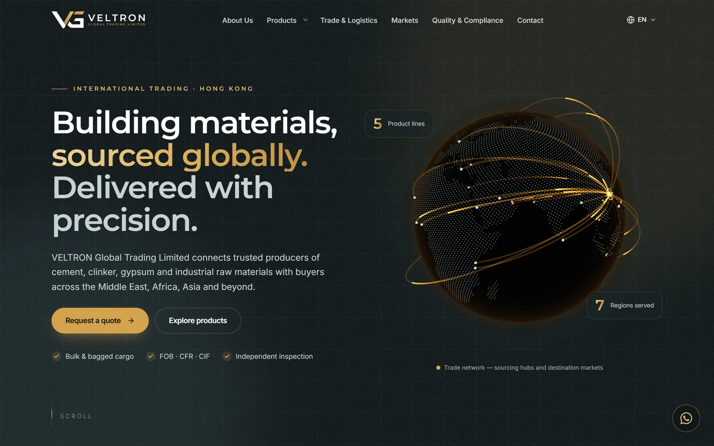<p align="center"><sub><b>Home</b> — hero with the interactive 3D trade globe</sub></p></td>
    <td width="50%">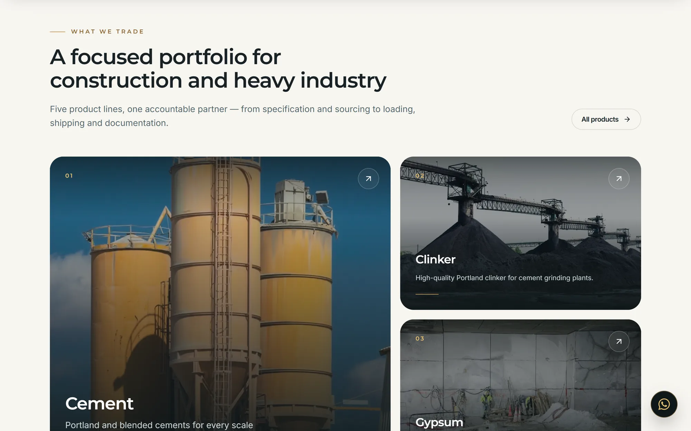<p align="center"><sub><b>Product portfolio</b> — bento grid with 3D tilt cards</sub></p></td>
  </tr>
  <tr>
    <td width="50%">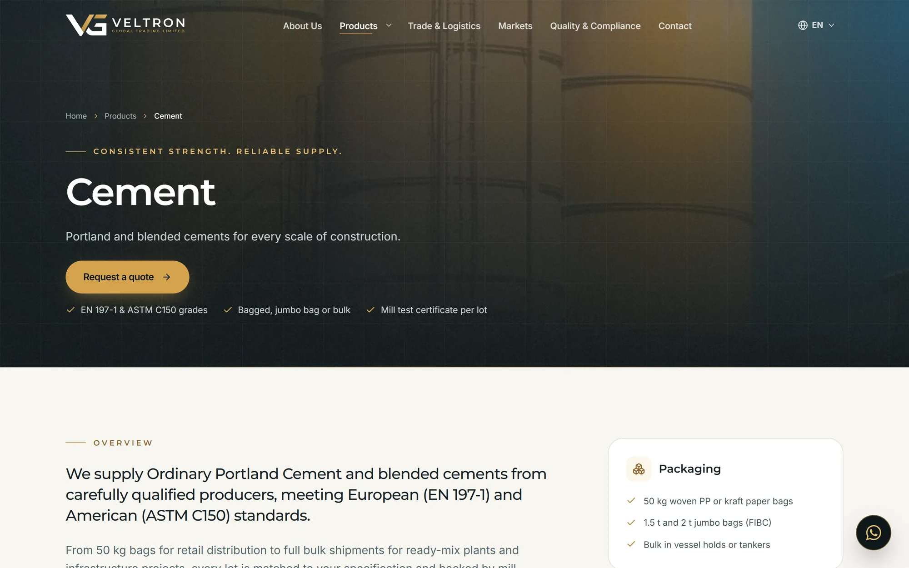<p align="center"><sub><b>Product detail</b> — grades, specifications, packaging</sub></p></td>
    <td width="50%">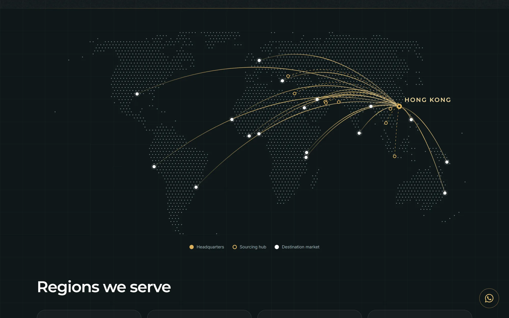<p align="center"><sub><b>Markets</b> — interactive trade-network map</sub></p></td>
  </tr>
  <tr>
    <td width="50%">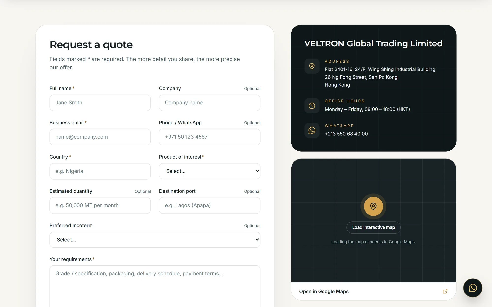<p align="center"><sub><b>Contact</b> — quote request form</sub></p></td>
    <td width="50%">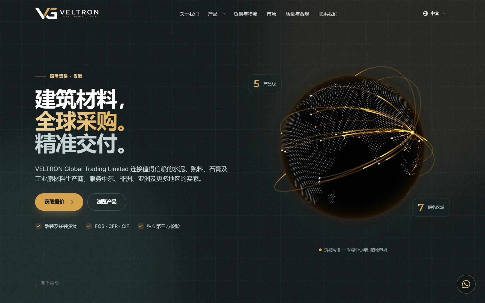<p align="center"><sub><b>Simplified Chinese</b> — full localisation</sub></p></td>
  </tr>
</table>

### Mobile

<table>
  <tr>
    <td width="25%">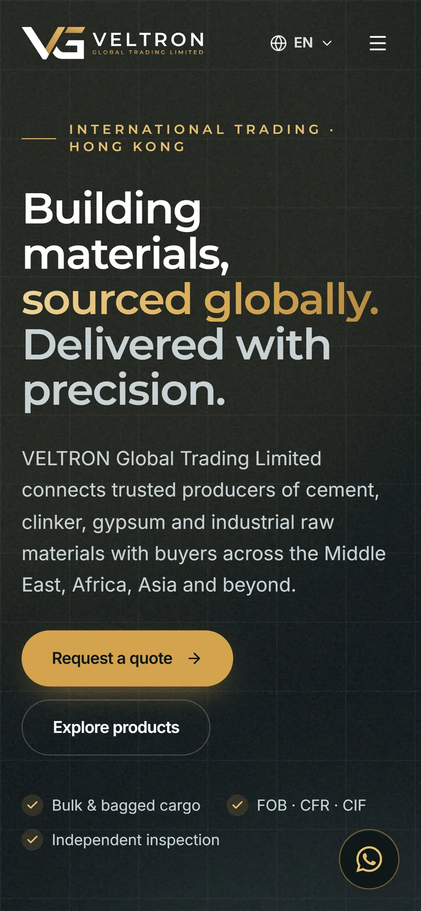<p align="center"><sub><b>Home</b></sub></p></td>
    <td width="25%">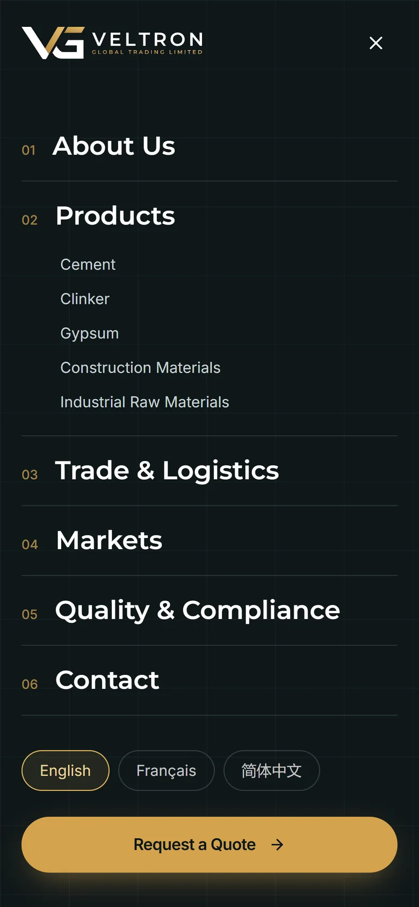<p align="center"><sub><b>Navigation</b></sub></p></td>
    <td width="25%">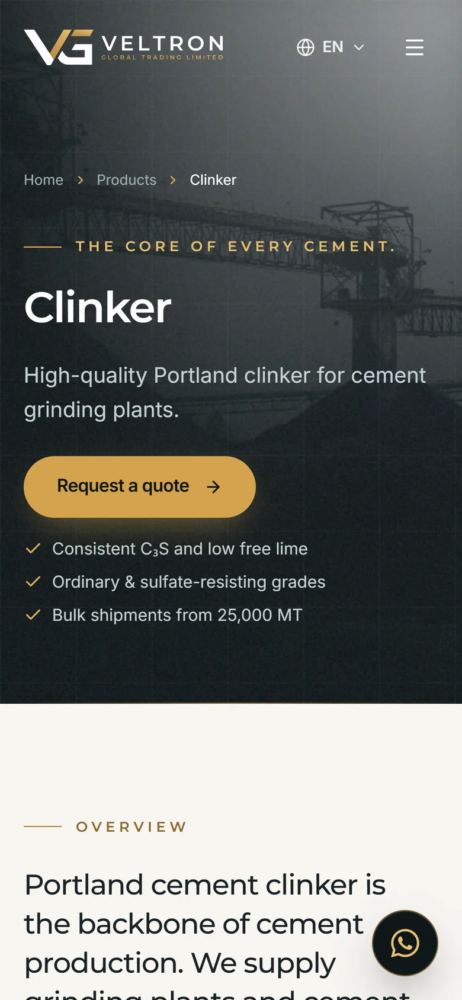<p align="center"><sub><b>Product detail</b></sub></p></td>
    <td width="25%">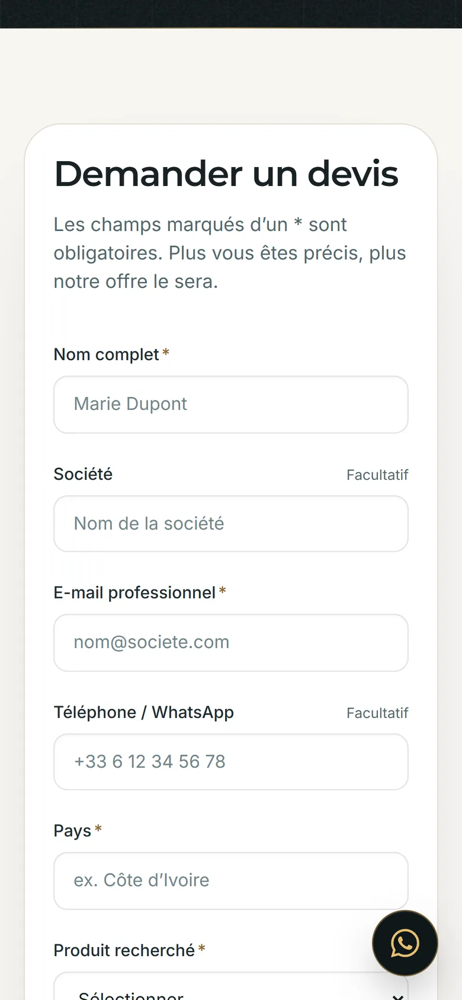<p align="center"><sub><b>Contact (French)</b></sub></p></td>
  </tr>
</table>

## Features

**Experience & design**
- Custom brand system rebuilt from the client's printed logo as pixel-exact vector artwork (logo lockups, favicons, app icons, social preview image)
- Interactive 3D globe (three.js) with great-circle trade routes, drag-to-spin and an animated Hong Kong hub
- Page transitions (View Transitions API), smooth scrolling, scroll-driven parallax and progress indicator
- 3D tilt cards, magnetic buttons, cursor-following spotlight, mask-reveal typography and count-up statistics
- Floating WhatsApp click-to-chat with a localised pre-filled message
- Fully responsive, from 360 px phones to wide desktop screens

**Internationalisation**
- English (default), French and Simplified Chinese, with language-preserving URLs (`/en`, `/fr`, `/zh`)
- Type-checked dictionaries — a missing translation fails the build
- Localised metadata, `hreflang` alternates and a multilingual sitemap

**Inquiry backend**
- Vercel Function (`POST /api/contact`) sharing one zod schema with the browser form
- Cloudflare Turnstile, honeypot and fill-time heuristics against spam
- Per-IP rate limiting (Upstash Redis, with an in-memory fallback)
- Branded HTML notification via Resend (reply-to the visitor) and an optional localised auto-reply
- Origin checks, payload limits, HTML escaping and header-injection-safe email subjects

**Performance, accessibility & SEO**
- Static pre-rendering: every page ships complete HTML, then hydrates into a single-page app
- Responsive AVIF/WebP imagery, lazily loaded 3D and smooth-scroll code, no layout shift
- WCAG AA contrast, keyboard navigation, focus management and full `prefers-reduced-motion` support
- Strict Content Security Policy, HSTS and hardened security headers

## Tech Stack

| Layer | Technology |
| --- | --- |
| Framework | React 19 · React Router 8 (framework mode, static pre-rendering) |
| Language | TypeScript (strict) |
| Build & runtime | Vite 8 · Bun |
| Styling | Tailwind CSS 4 · custom design tokens |
| Motion & 3D | Motion · three.js (WebGL) · Lenis · CSS scroll-driven animations |
| Forms & validation | react-hook-form · zod |
| Backend | Vercel Functions (Node.js 22) |
| Email | Resend |
| Security | Cloudflare Turnstile · Upstash Redis rate limiting · strict CSP |
| Asset pipeline | sharp · opentype.js · d3-geo · topojson |
| Code quality | Biome · knip |
| Hosting | Vercel |

## Architecture

```
api/                  Serverless inquiry endpoint (Vercel Function)
shared/               Code shared by browser and API — validation schema, catalogue, locales
app/
  routes/             Pages — loaders run at build time, so each page ships only its own content
  components/         UI, layout, sections, 3D globe, map, forms and motion primitives
  i18n/               Dictionaries (en · fr · zh) and locale utilities
  config/             Site configuration and URL structure
public/               Static assets — brand, icons, optimised images, map data
scripts/              Asset pipelines (brand, images, maps) and build verification
```

## Getting Started

**Prerequisites:** [Bun](https://bun.sh) 1.3+ · Node.js 22

```bash
bun install
cp .env.example .env   # fill in the values below
bun run dev            # http://localhost:5173 — site and API
```

| Command | Description |
| --- | --- |
| `bun run dev` | Development server (site + local API) |
| `bun run build` | Production build with pre-rendering and output verification |
| `bun run preview` | Serve the production build locally |
| `bun run check` | Type-check, lint, dead-code analysis and production build |

### Environment variables

| Variable | Required | Purpose |
| --- | --- | --- |
| `RESEND_API_KEY` | ✅ | Resend API key |
| `CONTACT_TO_EMAIL` | ✅ | Inbox that receives inquiries (comma-separated for several) |
| `CONTACT_FROM_EMAIL` | ✅ | Verified sender, e.g. `VELTRON Website <website@domain.com>` |
| `TURNSTILE_SECRET_KEY` | ✅ | Cloudflare Turnstile secret key |
| `VITE_TURNSTILE_SITE_KEY` | ✅ | Cloudflare Turnstile site key (build-time) |
| `VITE_SITE_URL` | Recommended | Canonical site origin |
| `UPSTASH_REDIS_REST_URL` / `UPSTASH_REDIS_REST_TOKEN` | Recommended | Global rate limiting |
| `CONTACT_AUTOREPLY` | Optional | `true` to send visitors a localised confirmation |

### Deployment

Deployed on **Vercel** — `vercel.json` defines the build, output, functions, redirects, caching and security headers. Import the repository, set the environment variables above and deploy.

## Author

Designed and developed by **[Alaa Younsi](https://github.com/Alaa-Younsi)** — design, front-end, back-end, 3D and brand asset pipeline.

## License

**Proprietary — All Rights Reserved.** © 2026 Alaa Younsi.

This source code is private property. No licence is granted: it may not be used, copied, modified, distributed or deployed, in whole or in part, without prior written permission. The repository is publicly visible for portfolio purposes only. See [LICENSE](LICENSE) for the full terms.

The VELTRON name and logo are the property of VELTRON Global Trading Limited.
